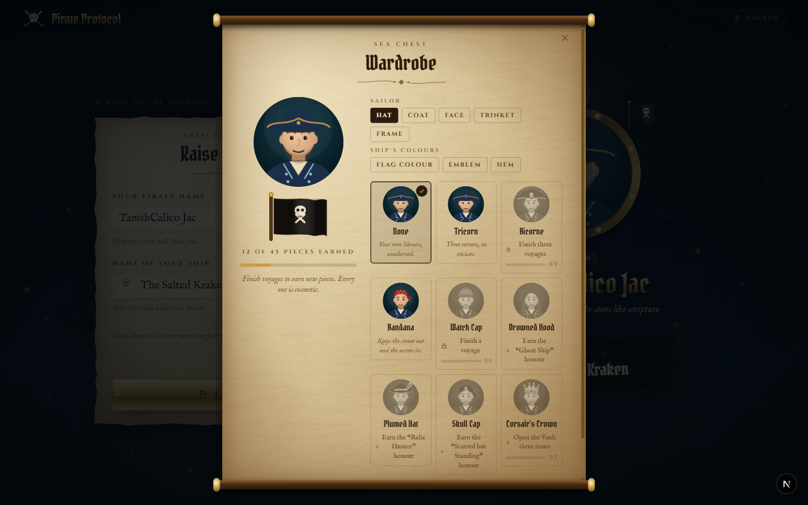
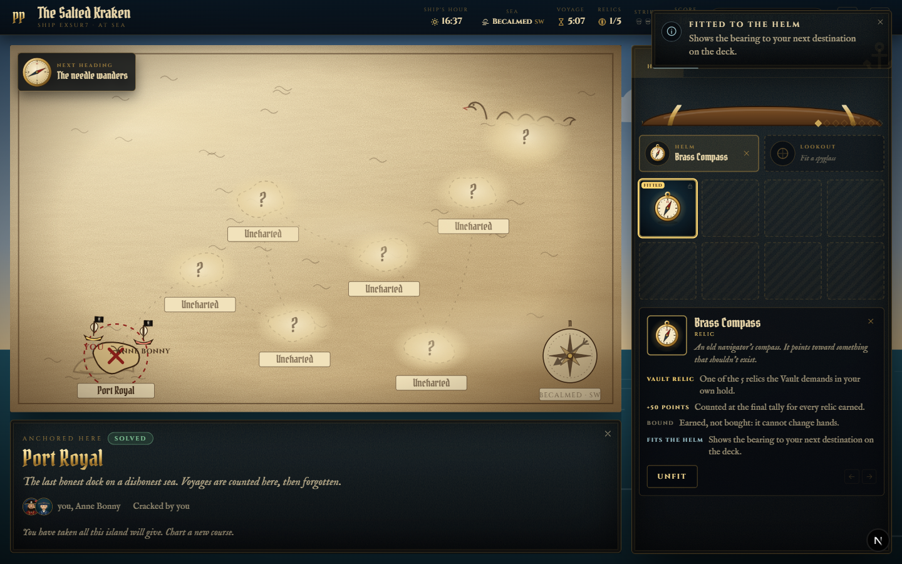
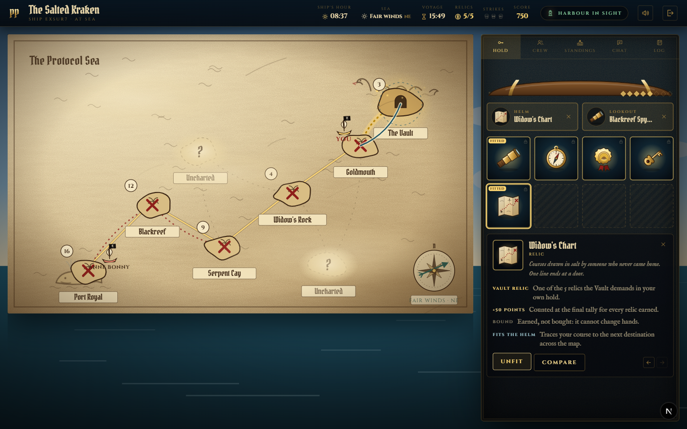
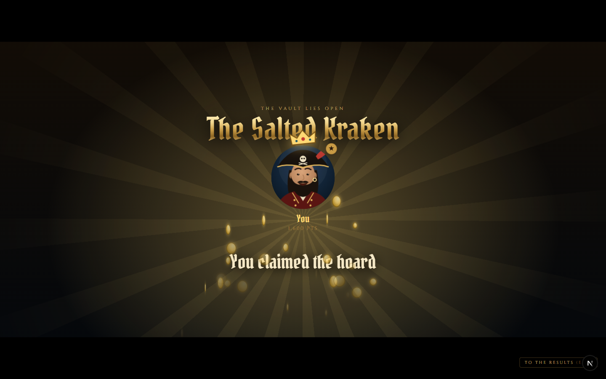

# Pirate Protocol — Frontend Work Summary (Person B)

All work lives in `frontend/`. Person A's NestJS backend at the repo root was not touched.
The server stays authoritative: the frontend never checks answers, never invents gameplay data,
and trading still goes through the existing `trade:offer` event.

## Verification (run on Oct 4, 2026)

| Check | Result |
| --- | --- |
| `npx tsc --noEmit` | passes |
| `npx eslint src mock-server` | 0 errors, 0 warnings |
| `npx vitest run` | **466 tests passed** in 20 files |
| `npm run test:mp` (real servers, many sockets) | **27 tests passed** in 4 files |
| `npm run build` (mock mode) | passes (includes the new `/legends` route) |
| `NEXT_PUBLIC_BACKEND=nest npm run build` | passes |
| Live run (mock server + dev server, two sailors, Playwright) | full voyage from create to Vault to results |

## What was built

### 1. Cinematic transitions (`src/components/cinema/`)
- **`SetSailCinematic`**: the voyage opening. The camera dives into the ocean, the folded chart unfolds in 3D, then the crew name appears and the compass spins to the first destination. It plays once per voyage per tab, only within the first 30 s, and never when reduced motion is on. Esc, Enter, Space or the Skip button ends it.
- **`CompassReveal`**: after each of your solves (and when the Vault awakens), a compass spins and settles on your next destination. Uncharted islands are shown only as a direction, never named.
- **`VictoryCinematic`**: the crew lines up in the server's rank order. The winner steps forward and gets a crown, god rays and a coin burst for treasure finishes; on a wreck the lineup sinks. It only presents the server's `winnerPlayerId` and `scores`.
- **`Letterbox`**: the shared cinema-bar stage with a skip control.

### 2. Evolving avatars (`src/components/avatar/`)
- **Wardrobe**: hats, coats, face pieces, trinkets, frames, flag colour, emblem and hem. Pieces unlock from the career record copied from finished server state, and a locked piece shows its requirement and progress.
- **`AvatarFrame`**: rope, brass, silver, gold and legendary frames (laurel, gem and sparkles).
- **`ShipFlag`**: a waving custom flag, also flown on your ship on the map.
- **`LivingAvatar`**: idle blink, breathing, pipe smoke and parrot. Avatars react (cheer, shock, grim, sly) to real server events through `useCrewReactions`.
- **`ChestUnlocks`**: the results screen lists the pieces this voyage unlocked.

### 3. Inventory as a treasure chest (`src/components/voyage/Inventory.tsx`, `ItemArt.tsx`)
- A chest with an opening lid and cargo pips, and 8 berths (`HOLD_BERTHS`).
- **Drag and drop**: reorder berths, drag a tool onto the helm or lookout, or drag an item onto a crewmate to open the existing trade dialog. Keyboard alternatives: Fit/Unfit, Offer, Compare, and Move left/right.
- **Gear**: compass on the helm shows the next heading; Widow's Chart on the helm draws the course line; spyglass on the lookout shows league distances. All of this is presentation only and is stored per tab.
- **Compare**: shows two items side by side using only real rules (rarity, Vault relic, tradeable, pays for hints, gear slot).
- Custom SVG art for all 8 items, with a halo per rarity.

### 4. Adaptive atmosphere
- **`AdaptiveSky`**: the sky follows in-game time. Timed voyages run 06:00 to 24:00; untimed voyages run a 16-minute day. It includes sun, moon, stars, clouds, distant lightning with a delayed rumble, and a sea that turns red near danger.
- **`danger.ts`**: danger rises with charted trap islands nearby, strikes, the kraken and storms. Danger zones are also drawn on the map.
- **`soundscape.ts`**: synthesized surf, wind, ship creaks, harbour bells, daytime gulls and a low danger drone, all driven by gameplay state.
- The HUD shows the "Ship's hour".

### New pure logic (unit-tested)
`sky.ts` (13 tests), `danger.ts` (8), `items.ts` (13), `heading.ts` (10), `gear.ts` (4), `reactions.ts` (8).

## Bugs found and fixed during the live run
1. **The next-destination compass went blank after the first solve.** The server hides an uncharted island's puzzles, so those islands were wrongly skipped. Fog now counts as work still to do, and a regression test covers it.
2. **SVG console errors** (`<path d="undefined">`) from the waving flag and the kraken tentacles. Fixed by giving the animated path an initial value.
3. Removed an unused import (lint warning).

> Note: an apparent "freeze" during the victory screen was Chrome throttling a window hidden behind
> another test window (1.5 fps → 30 fps after bringing it to front). Not an app bug.

## Screenshots (`docs/summary-shots/`)
| File | Shows |
| --- | --- |
| `21-wardrobe.png` | Wardrobe with locked pieces and progress |
| `22-lobby-flags.png` | Lobby cards with ship flags |
| `23-cinematic-dive.png` | Opening cinematic: crew title and compass |
| `26-voyage-sky-chest.png` | Daytime sky, gear rack, empty chest |
| `30-compass-fitted-helm.png` | Compass dragged onto the helm, heading readout |
| `33-spyglass-soundings.png` | Night sky, spyglass league marks |
| `34-compare.png` | Item comparison |
| `35-widow-chart-course.png` | Course line to the Vault |
| `40-victory-03.png` | Treasure finale |
| `40-victory-08.png` | Victory cinematic: crowned winner |
| `40-victory-13.png` | Results |
| `41-sea-chest-unlocks.png` | New wardrobe pieces earned |






## How to run
```bash
cd frontend
npm install
npm run mock:server        # terminal 1, port 4000
npm run dev                # terminal 2, port 3000
# With Person A's backend instead: set NEXT_PUBLIC_BACKEND=nest in .env.local
```

## Limitations
- Outfits are disabled in Nest mode (`CAPABILITIES.outfits = false`) until the backend supports `player:outfit`.
- Career, unlocks and gear layout are stored per device (localStorage/sessionStorage), not on the server.
- Audio starts only after the first user interaction (browser autoplay rules).
- Heavy effects (cinematics, god rays) are reserved for key moments; on machines without GPU acceleration they will be slower.

## Phase A: Captain's Log, map marks, accessibility, multiplayer tests
Built only in new files (plus small hooks in components nobody is retyping).

- **Captain's Log** (`lib/game/captainsLog.ts`, `components/voyage/CaptainsLog.tsx`): retells the server's event log as a story; every line maps to a recorded event. Shown on the results screen with "Copy log" and "Save as picture" (PNG).
- **Map marks** (`lib/socket/marks.ts`, `mock-server/marks.mjs`, `lib/game/useMapMarks.ts`, `components/voyage/MapMarksLayer.tsx`, `MarkToolbar.tsx`): pins, danger, treasure guesses and drawn routes, shared live with the crew. The server owns ids, ownership, 6-per-sailor limit, 3-minute expiry and rate limiting.
- **Accessibility** (`lib/a11y.ts`, `components/a11y/*`): menu in the bottom-left corner with high contrast, reduce motion, calm effects (no shake or lightning) and text size; skip link; arrow/Home/End keys move between islands; the opening cinematic skips itself under reduced motion.
- **Multiplayer tests** (`src/test/multiplayer/*`, `npm run test:mp`): spawns the real mock server on a free port and drives several socket clients: full launch, captain-only start, unready/too few, NAME_TAKEN (case-insensitive), ROOM_FULL, GAME_IN_PROGRESS, bad payloads, simultaneous same-name join race, drop and rejoin, forged token, captain hand-off, broadcasts, and the whole marks relay. 21/21 pass.

The retype was dropped: the full v3 game (contract, reducer, client, lobby, voyage page and the
v3 mock server) was restored from the dev build's source maps, and marks are wired in everywhere.

## Epic update: the world remembers
- **Hall of Legends** (`app/legends/page.tsx`, `lib/game/legends.ts`): finished voyages saved per device (max 24) from the server's event log: real routes, discoveries, wrecks, victor. Recorded automatically when the server declares the voyage over.
- **Ghost fleet** (`components/voyage/GhostFleet.tsx`): past crews' real routes replayed as ghost ships on the chart (1 normally, 4 on a Ghost Moon).
- **Seven Seas Calendar** (`lib/game/calendar.ts`, `components/atmosphere/SeaCondition.tsx`): deterministic condition per UTC day; badge on landing page and map, sky wash for Bloodstorm / Golden Tide / Ghost Moon, 7-day forecast.
- **Living Quest Journal** (`components/voyage/QuestJournal.tsx`, the J tab): riddles of charted islands, solved stamps, bought hints, pins.
- **Narrator** (`components/voyage/Narrator.tsx`, `narrateEvent` in `captainsLog.ts`): prewritten subtitles from live `game:event`s, optional browser voice; hushed on Silent Waters. No AI in the loop.
- **Living compass** (`HelmCompass.tsx`): storm spin in squalls/tempests, gold glow near the Vault, violet cracks while holding a Cursed Coin.
- **Captain's Gambit** (`mock-server/gambit.mjs`, `lib/socket/gambit.ts`, `lib/game/useGambit.ts`, `components/crew/GambitPanel.tsx`): server-rolled best-of-three dice duel, honour stakes only, pushes only to the two duellists. Hidden in Nest mode until Person A ports it.
- **Share** button on the Captain's Log (Web Share API with the PNG).
- **Backend specs** for Person A: `frontend/docs/BACKEND_SPECS.md` (Kraken Hunt, Hourglass, Disguise, roles, Black Market, One Chest, Nemesis, underground vaults, living islands, calendar).
- Tests: `legends.test.ts`, `calendar.test.ts`, narrator cases in `captainsLog.test.ts`, `gambit.mp.test.ts`; the lobby multiplayer tests now run against the v3 server (plus a rate-limit case).

## Git commands (not pushed)
```bash
cd C:\Users\tanis\Desktop\Thirdspace
git add frontend SUMMARY.md
git status
git commit -m "feat(frontend): restore v3 game; hall of legends, ghost fleet, sea calendar, quest journal, narrator, living compass, captain's gambit"
# when ready:
# git push origin main
```
`frontend/.recover/` (the source-map recovery scratch) is git-ignored; delete it once you're happy.
